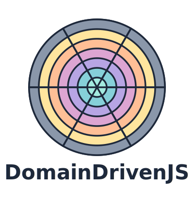

# Domainify

<div align="center">
  

  **A lightweight JavaScript library for building domain-driven applications**
</div>

## Overview

Domainify provides a powerful, type-safe toolkit for implementing Domain-Driven Design patterns in JavaScript or TypeScript. It helps you create rich domain models that enforce business rules, maintain consistency, and evolve with your business requirements.

## Features

- **Core DDD Building Blocks**: Create value objects, entities, aggregates, domain events, and repositories
- **Type-Safe Domain Models**: Integrated with Zod for runtime validation and type safety
- **Immutable By Design**: All domain objects are immutable to prevent accidental state changes
- **Event-Driven Architecture**: Publish and subscribe to domain events
- **Repository Adapters**: Easily connect to different data stores
- **Flexible Composition**: Extend and compose domain components

## Installation

```bash
npm install domainify zod
```

## Quick Example

```javascript
import { z } from 'zod';
import { valueObject, entity, aggregate } from 'domainify';

// Define a Money value object
const Money = valueObject({
  name: 'Money',
  schema: z.object({
    amount: z.number().nonnegative(),
    currency: z.string().length(3)
  }),
  methods: {
    add(other) {
      if (this.currency !== other.currency) {
        throw new Error(`Cannot add ${other.currency} to ${this.currency}`);
      }
      return Money.create({ 
        amount: this.amount + other.amount, 
        currency: this.currency 
      });
    }
  }
});

// Create and use a value object
const price = Money.create({ amount: 99.99, currency: 'USD' });
const tax = Money.create({ amount: 8.00, currency: 'USD' });
const total = price.add(tax);

console.log(total.format()); // $107.99
```

## Documentation

For full documentation, visit our [documentation site](https://github.com/yourusername/domainify/docs).

- [Getting Started](./docs/guide/getting-started.md)
- [Core Concepts](./docs/guide/core/index.md)
- [Examples](./docs/examples/index.md)
- [API Reference](./docs/api/index.md)

## License

MIT